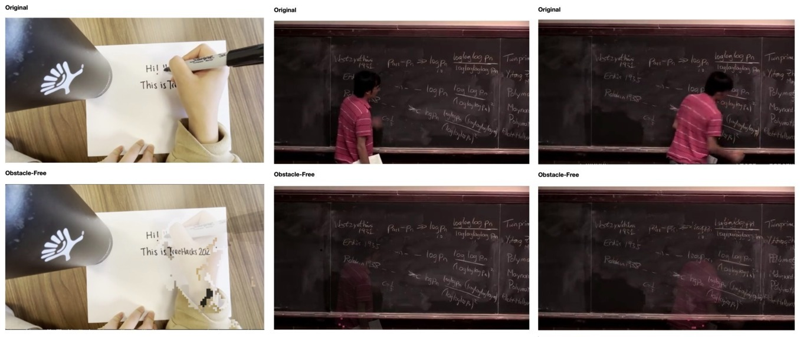

# ClearBoard

A real-time obstruction-removal algorithm for whiteboarding applications.



Contributors: [WenXin Dong](https://github.com/WenXinDong2018), [Daniel Huang](https://github.com/pi314ever), [Sahil Tadwalkar](https://github.com/stadwalkar)

---

## Table of Contents

<!-- @import "[TOC]" {cmd="toc" depthFrom=1 depthTo=6 orderedList=false} -->

<!-- code_chunk_output -->

- [ClearBoard](#clearboard)
  - [Table of Contents](#table-of-contents)
  - [1. Project Description](#1-project-description)
    - [1.1 Inspiration](#11-inspiration)
    - [1.2 What it does](#12-what-it-does)
    - [1.3 How we built it](#13-how-we-built-it)
    - [1.4 Challenges we ran into](#14-challenges-we-ran-into)
    - [1.5 Accomplishments that we're proud of](#15-accomplishments-that-were-proud-of)
    - [1.6 What we learned](#16-what-we-learned)
    - [1.7 What's next for ClearBoard](#17-whats-next-for-clearboard)
  - [2. Environment setup](#2-environment-setup)
  - [3. Run basic examples](#3-run-basic-examples)
  - [4. Links](#4-links)

<!-- /code_chunk_output -->
## 1. Project Description

### 1.1 Inspiration

Many students attend remote tutoring. However, it is difficult to communicate concepts if the tutor and the student do not have a tablet to write on. The alternative options, such as zoom whiteboard, are clumsy to use without specialized hardware. We wanted to tackle this problem and streamline the remote learning experience.

### 1.2 What it does

ClearBoard is a real-time video processing software that detects and removes moving obstacles in front of writing surfaces, such as whiteboard, blackboard, and paper. Imagine a semi-transparent hand writing on a piece of paper, such that you could see everything written on the paper without the hand blocking it. ClearBoard is a light-weight software that works in real-time, able to process laptop camera and phone camera feed, as well as .mp4 files.

### 1.3 How we built it

ClearBoard utilizes OpenCV and PyTorch libraries to process video frames using computer vision techniques.

### 1.4 Challenges we ran into

Since the ClearBoard runs in real time, we are limited in the types of algorithms we could use to perform obstacle detection. Furthermore, removing objects reliably while still maintaining visibility of the written whiteboard posed challenges in fine-tuning the algorithm.

### 1.5 Accomplishments that we're proud of

As a team of 3, we are proud of developing an efficient workflow and parallelizing the work of iteratively improving the algorithm. Through trial and error, we learned which of our initial ideas were feasible and were able to quickly implement multiple iterations in a short time span. We are also proud that the people we presented our project to found this idea useful.

### 1.6 What we learned

Innovation and creativity thrive in an open-communication environment. Being able bounce ideas back and forth between teammates was crucial in maintaining a high-productivity development environment. Furthermore, python development balances the ease of a high-level language with the ability to call fast low-level languages through packages, which is essential in maintaining performance as the algorithms iterated.

### 1.7 What's next for ClearBoard

The current obstacle-detection algorithm works well, but we hope to improve it and make it more robust to a wide range of settings by potentially introducing a machine-learning model. Developing a user interface or API to integrate into current online meeting applications is also a high priority to improve usability and reach.

## 2. Environment setup

From the repo root directory:

```sh
conda env create -f environment.yml
```

Updating environment:

```sh
conda env update -f environment.yml --prune
```

## 3. Run basic examples

Webcam feed:

```sh
sh webcam_feed.sh
```

Example video feed:
```sh
sh terry_tao_feed.sh
```

## 4. Links

[Reference Video](https://www.youtube.com/watch?v=pp06oGD4m00)
